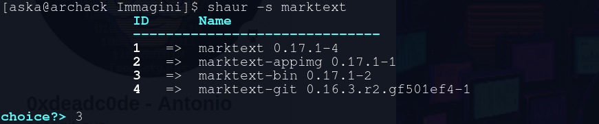
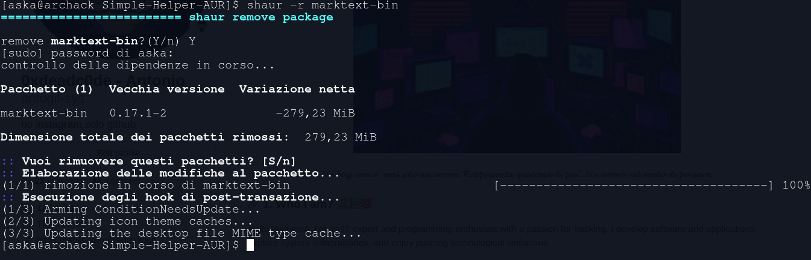

<h1 align = "center"> Simple Helper AUR (shaur) 🦅 </h1>
<h1 align = "center">
    
</h1>

<h3>Index </h3>
<ol>
    <li><a href='#t1'>Introduction</a></li>
    <li><a href='#t2'>Security Notes</a></li>
    <li><a href='#t3'>Requires System</a></li>
    <li><a href='#t4'>Installation</a></li>
    <li><a href='#t5'>Use</a></li>
		<ul>
			<li><a href='#t5.1'>search</a></li>
			<li><a href='#t5.2'>install</a></li>
			<li><a href='#t5.3'>list installed of package</a></li>
			<li><a href='#t5.4'>update (a package)</a></li>
			<li><a href='#t5.5'>update (all)</a></li>
			<li><a href='#t5.6'>remove</a></li>
		</ul>
    <li><a href='#t6'>Uninstallation</a></li>
</ol>

<hr>

<a name="t1"></a>

## 1. Introdution 🚀

**SHAUR**,  acronym for **S**imple **H**elper **AUR**, is a very minimal and functional AUR helper. Its task is to greatly simplify what well-known AUR helpers do, adding many more functionalities like AUR package tracking. Imagine tackling the climb of Everest: while other AUR helpers force you to struggle along steep and rugged slopes, with Shaur it's like having wings. It lifts you towards the highest peaks with astonishing speed, overcoming every obstacle along the way and taking you directly to the AUR summit without even feeling the fatigue of the ascent.

<a name="t2"></a>

## 2. Security Notes 📄🛡️

For security reasons, SHAUR cannot be executed or installed directly by the root user. However, this does not mean that SHAUR does not make use of elevated privileges. In fact, it only utilizes such privileges for specific operations such as **removing** AUR packages from the system and **updating** local packages. 

While most AUR helpers advise against running as the root user, **SHAUR enforces, for security reasons, the necessity of always operating as a normal user.** This control was personally implemented prior to the introduction of a requests handler in the form of an anonymous function.

<a name="t3"></a>

## 3. Requires System 🖥️

1) **Operation System:** Arch linux and derivatives

2) **Shell:** Bash

3) **Package Manager:** Pacman 

<a name="t4"></a>

## 4. installation (!usermode)

1) clone the repository

```bash
git clone https://github.com/antogit-sys/Simple-Helper-AUR.git
```

2. go to Simple-Helper-AUR/

```bash
cd Simple-Helper-AUR/
```

3. install shaur

> Execute the install.sh file in user mode, otherwise it will not start.

```bash
bash install.sh
```

 and wait a few seconds


*Proceed with the Enter key*.


> To invoke SHAUR, type 'shaur' 
> or 'shaur help' or ' shaur --help' or 'shaur -h' or shaur help'.

```bash
$ shaur help
```

<a name="t5"></a>

## 5. Use

Let's assume wee need to work with the package "marktext-bin", not knowing the exact name of package.

Options:

<a name="t5.1"></a>

<ul><li>search</li></ul>

```bash
shaur -s marktext
```




<i>Note: if we search directly for the package name, SHAUR will provide us with the details directly</i>

<a name="t5.2"></a>

<ul><li>install</li></ul>

```bash
shaur -i marktext-bin
```


<i>Before cloning the package and reading the PKGBUILD, SHAUR takes care of checking for updates of already installed local packages (it's good to confirm the update).</i>
<br>
<br>
<br>

<i>Verify that everything is okay and press 'q' to exit</i>
<br>
<br>
<br>

<i>Press Enter to install the package.</i>
<br>
<br>
<br>

<a name="t5.3"></a>

<ul><li>list of installed packages</li></ul>

```bash
shaur -l
```


<br><br>

<a name="t5.4"></a>

<ul><li>update (a package)</li></ul>

```bash
shaur -u marktext-bin
```


<br>

<a name="t5.5"></a>

<ul><li>update (all)</li></ul>

```bash
shaur -ua
```


> Note: the actual command to be executed is 'git pull'.

<br>

<a name="t5.6"></a>

<ul><li>remove package</li></ul>

```bash
shaur -r marktext-bin
```



<a name="t6"></a>

## 6. Uninstallation Shaur

go to Simple-Helper-AUR directory

```bash
cd Simple-Helper-AUR/
```

Run as a normal user uninstall.sh

```bash
bash uninstall.sh
```


> Warning: once SHAUR is uninstalled, the packages will not be removed; they will simply be treated as local packages. 
